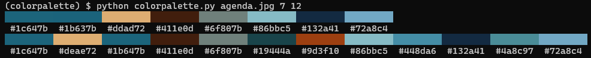

# color-thief-cli

CLI interface for [fengsp/color-thief-py](https://github.com/lokesh/color-thief/).

## Usage

```
usage: colorpalette.py [-h] path N [N ...]

Grab the color palette from an image

positional arguments:
  path        image path
  N           Number of colors

optional arguments:
  -h, --help  show this help message and exit
```


 ## Example


